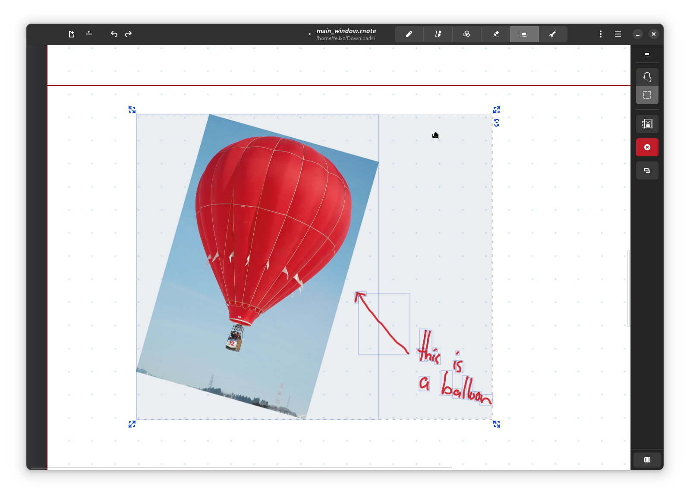

<div align="center">
</img>
</div><br><br><br>

<div align="start">
    <a href="https://liberapay.com/flxzt/donate">
        
    </a>
    <a href="https://www.paypal.com/donate?hosted_button_id=LQ9Q4868GKQGG">
        
    </a>
</div><br>

# Rnote
A simple note taking application written in Rust and GTK4.

Rnote aims to be a simple but functional note taking application for freehand drawing or annotating pictures or documents. It eventually should be able to import / export various media file formats.  
One main consideration is that it is vector based, which should make it very flexible in editing and altering the contents.

**Disclaimer**  
This is my first Rust and GTK project and I am learning as I go along. Expect some bugs and crashes.

## Installation
Rnote is available as  a flatpak on Flathub:

<br><div align="start">
<a href='https://flathub.org/apps/details/com.github.flxzt.rnote'></a>
</div><br>


## Feature Ideas:
* Stroke history list widget
    * with the ability to move them up and down the history / layers
* Stroke trash restorer
    *  with a preview of the deleted strokes
* Stylus buttons configuration to map them to different actions and / or pen types 
* Sticky selection: drag along parts of the selected strokes based on the proximity of a round pen tool
* Locked strokes: Selection mode to toggle the mutability of strokes

## To-Do
- [x] switch geometry to [nalgebra](https://crates.io/crates/nalgebra) wherever possible. It can operate on f64 and has much more features than graphene.
- [ ] template deduplication when loading in .rnote save files.
- [x] printing & PDF export
- [x] PDF import
- [x] vector & bitmap picture import
- [ ] export as bitmap picture
- [x] implement bezier curve stroke with variable stroke width
    (see [Quadratic bezier offsetting with selective subdivision](https://microbians.com/math/Gabriel_Suchowolski_Quadratic_bezier_offsetting_with_selective_subdivision.pdf),
    [Precise offsetting of bezier curves](https://blend2d.com/research/precise_offset_curves.pdf))
- [ ] (implemented: lines, rectangles, ellipses) drawing rough shapes by porting [rough.js](https://roughjs.com/) to Rust (see `./src/rough-rs`)
- [x] parallelizing rendering and actions which affect many strokes.
- [ ] limit rendering to visible strokes based on the current viewport of the canvas ( culling )
- [ ] implement text fields
- [ ] implement optional stroke smoothing

## Screenshots

If you have drawn something cool in Rnote and want to share it, let me know so I can include it as a screenshot. :)




### Building with Flatpak
There is a flatpak manifest in `build-aux/com.github.flxzt.rnote.Devel.json`.

Use Gnome Builder or vscode with the flatpak extension to build and run the application for you. **This is the easiest and recommended way.**

**Bugs and workarounds**

- If you encounter `bwrap: Can't find source path /run/user/1000/doc/by-app/com.github.flxzt.rnote: No such file or directory` when trying to run the flatpak, `xdg-document-portal` did not start yet. Starting it manually with `systemctl start --user xdg-document-portal` should fix it.

--- 

If you don't have an IDE or extension to handle building flatpaks, you can also do it manually:

First the Gnome 41 SDK is needed:

```bash
flatpak install org.gnome.Sdk//41 org.freedesktop.Sdk.Extension.rust-stable//21.08 org.gnome.Platform//41
```

**Build**  
Building the app with flatpak is done with:

```bash
flatpak-builder --user flatpak-app build-aux/com.github.flxzt.rnote.Devel.json
```

Creating a repo:

```bash
flatpak-builder --user --repo=flatpak-repo flatpak-app build-aux/com.github.flxzt.rnote.Devel.json
```


**Install**  
Install to the system as user with:

```bash
flatpak-builder --user --install flatpak-app build-aux/com.github.flxzt.rnote.Devel.json
```

**Run**  
Then it can be run.
From the build directory:

```bash
flatpak-builder --run flatpak-app build-aux/com.github.flxzt.rnote.Devel.json rnote
```

Or if it is installed:

```bash
flatpak run com.github.flxzt.rnote
```

### Build with Meson
The flatpak manifest calls the meson build system to build the application.
If a native build is wanted, meson can be called directly.

Make sure `rustc` and `cargo` are installed. Then run:

```bash
meson setup --prefix=/usr _mesonbuild
```
Meson will ask for the user password when needed.

To enable the development profile, set `-Dprofile=devel` as a parameter. Else the `default` profile will be set. ( This can be reconfigured later )

**Compile**  
Once the project is configured, it can be compiled with:

```bash
meson compile -C _mesonbuild
```

The compiled binary should now be here: `./_mesonbuild/target/release/rnote`.

**Install**  
Installing the binary into the system can be done with:

```bash
meson install -C _mesonbuild
```

**Test**  
Meson has some tests to validate the desktop, gresources, ... files.

```bash
meson test -v -C _mesonbuild
```

This places the files in the specified prefix and their subpaths. The binary should now be in `/usr/bin` (and therefore in PATH)

**Reconfigure**  
reconfiguring the meson build files can be done with:

```bash
meson configure -Dprofile=default _mesonbuild
```

For example if the profile needs to be changed.


**Uninstall**  
If you don't like rnote, or decided that is not worth your precious disk space, you can always uninstall it with:

```bash
sudo ninja uninstall -C _mesonbuild
```